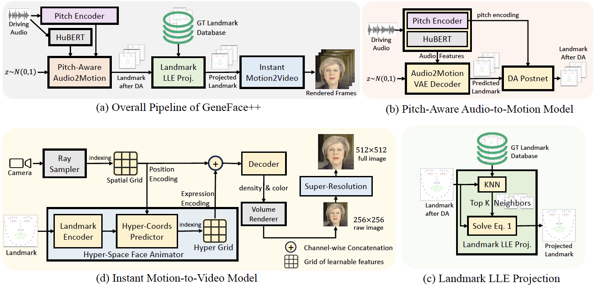

# GeneFace++: Generalized and Stable Real-Time 3D Talking Face Generation

[](https://arxiv.org/abs/2305.00787)| [](https://github.com/yerfor/GeneFacePlusPlus) | [](https://github.com/yerfor/GeneFacePlusPlus/releases) | 

[English Readme](./README.md)

这个仓库是GeneFace++的官方PyTorch实现，用于实现高嘴形对齐(lip-sync)、高视频真实度(video reality)、高系统效率(system efficiency)的虚拟人视频合成。您可以访问我们的[项目页面](https://genefaceplusplus.github.io/)以观看Demo视频, 阅读我们的[论文](https://arxiv.org/abs/2301.13430)以了解技术细节。

<p align="center">
    <br>
    
    <br>
</p>

## 您可能同样感兴趣
- 我们发布了Real3D-portrait (ICLR 2024 Spotlight), ([https://github.com/yerfor/Real3DPortrait](https://github.com/yerfor/Real3DPortrait)), 一个基于NeRF的单图驱动说话人合成系统, 仅需上传一张照片即可合成真实的说话人视频!

## 快速上手！
我们在这里提供一个最快体验GeneFace++的流程。

- 步骤1：根据我们在`docs/prepare_env/install_guide.md`中的步骤，新建一个名为`geneface`的Python环境，并下载所需的3DMM文件。

- 步骤2：下载预处理好的May的数据集 `trainval_dataset.npy` ([Google Drive](https://drive.google.com/drive/folders/1SwZ7uRa5ESzzq_Cd21-Lk5heAZxa9oZO?usp=sharing) 或 [BaiduYun Disk](https://pan.baidu.com/s/1U_FalVoxgb9sAb9FD1cZEw?pwd=98n4) 提取码: 98n4), 放置在`data/binary/videos/May/trainval_dataset.npy`路径下。

- 步骤3：下载预训练好的通用的audio-to-motino模型 `audio2motion_vae.zip` ([Google Drive](https://drive.google.com/drive/folders/1M6CQH52lG_yZj7oCMaepn3Qsvb-8W2pT?usp=sharing) 或 [BaiduYun Disk](https://pan.baidu.com/s/1U_FalVoxgb9sAb9FD1cZEw?pwd=98n4) 提取码: 98n4) 和专用于May的motion-to-video模型 `motion2video_nerf.zip` ([Google Drive](https://drive.google.com/drive/folders/1M6CQH52lG_yZj7oCMaepn3Qsvb-8W2pT?usp=sharing) 或 [BaiduYun Disk](https://pan.baidu.com/s/1U_FalVoxgb9sAb9FD1cZEw?pwd=98n4) 提取码: 98n4), 解压到`./checkpoints/`目录下。

做完上面的步骤后，您的 `checkpoints`和`data` 文件夹的结构应该是这样的：

```shell
> checkpoints
    > audio2motion_vae
    > motion2video_nerf
        > may_head
        > may_torso
> data
    > binary
        > videos
            > May
                trainval_dataset.npy
```

- 步骤4: 激活`geneface`的Python环境，然后执行: 
```bash
export PYTHONPATH=./
python inference/genefacepp_infer.py --a2m_ckpt=checkpoints/audio2motion_vae --head_ckpt= --torso_ckpt=checkpoints/motion2video_nerf/may_torso --drv_aud=data/raw/val_wavs/MacronSpeech.wav --out_name=may_demo.mp4
```
  - 或者可以使用我们提供的Gradio WebUI: 
```bash
export PYTHONPATH=./
python inference/app_genefacepp.py --a2m_ckpt=checkpoints/audio2motion_vae --head_ckpt= --torso_ckpt=checkpoints/motion2video_nerf/may_torso
```
  - 抑或可以使用我们提供的[Google Colab](https://colab.research.google.com/github/yerfor/GeneFacePlusPlus/blob/main/inference/genefacepp_demo.ipynb)，运行其中的所有cell。

## 在自己的视频上训练GeneFace++
如果您想在您自己的目标人物视频上训练GeneFace++，请遵循 `docs/process_data`和`docs/train_and_infer/`中的步骤。

## ToDo
- [x] **Release Inference Code of Audio2Motion and Motion2Video.**
- [x] **Release Pre-trained weights of Audio2Motion and Motion2Video.**
- [x] **Release Training Code of Motino2Video Renderer.**
- [x] **Release Gradio Demo.**
- [x] **Release Google Colab.**
- [ ] **Release Training Code of Audio2Motion and Post-Net.**

## 引用
如果这个仓库对你有帮助，请考虑引用我们的工作:
```
@article{ye2023geneface,
  title={GeneFace: Generalized and High-Fidelity Audio-Driven 3D Talking Face Synthesis},
  author={Ye, Zhenhui and Jiang, Ziyue and Ren, Yi and Liu, Jinglin and He, Jinzheng and Zhao, Zhou},
  journal={arXiv preprint arXiv:2301.13430},
  year={2023}
}
@article{ye2023geneface++,
  title={GeneFace++: Generalized and Stable Real-Time Audio-Driven 3D Talking Face Generation},
  author={Ye, Zhenhui and He, Jinzheng and Jiang, Ziyue and Huang, Rongjie and Huang, Jiawei and Liu, Jinglin and Ren, Yi and Yin, Xiang and Ma, Zejun and Zhao, Zhou},
  journal={arXiv preprint arXiv:2305.00787},
  year={2023}
}
```
