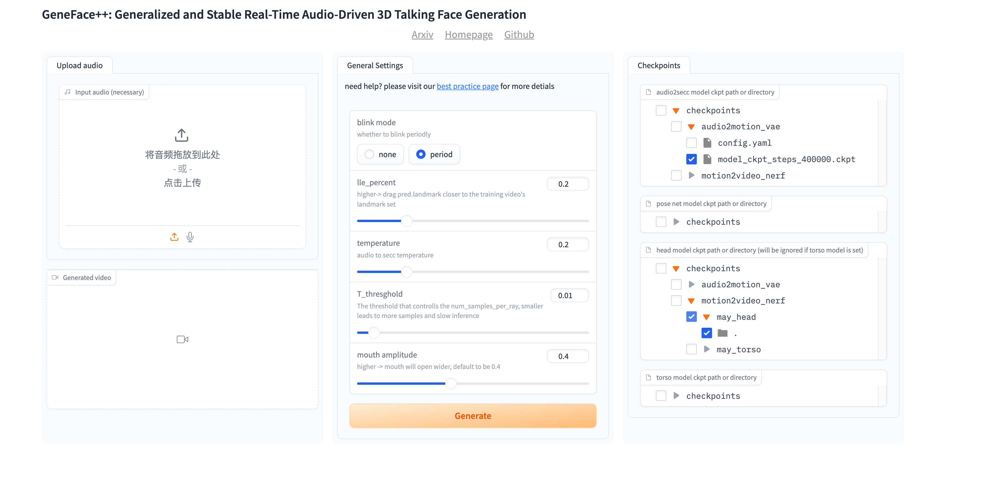

# 获取Audio2Motion模型
[English Doc](./guide.md)

我们提供预训练好的Audio2Motion模型（在voxceleb2,一个2000小时的英文数据集上训练）。你可以从[Google Drive](https://drive.google.com/drive/folders/1FqvNbQgOSkvVO8i-vCDJmKM4ppPZjUpL?usp=sharing) 或 [BaiduYun Disk](https://pan.baidu.com/s/19UZxMrO-ZvkOeYzUkOKsTQ?pwd=9cqp) (密码 9cqp) 下载预训练的Audio2Motion模型，并将模型放在 `checkpoints/audio2motion_vae`里。

# Train Motion2Video Renderer
你需要先遵循 `docs/process_data/guide.md` 的步骤来获得预处理后的数据集，并且你可以找到一个二进制化的 `.npy` 文件 `data/binary/videos/{Video_ID}/trainval_dataset.npy` (Video_ID 是目标的人物名字, 这里我们指定 `May` 作为例子.)

```
# 训练 Head NeRF 模型
# 模型与tensorboard会被保存在 `checkpoints/<exp_name>`
CUDA_VISIBLE_DEVICES=0 python tasks/run.py --config=egs/datasets/May/lm3d_radnerf_sr.yaml --exp_name=motion2video_nerf/may_head --reset

# 训练 Torso NeRF 模型
CUDA_VISIBLE_DEVICES=0 python tasks/run.py --config=egs/datasets/May/lm3d_radnerf_torso_sr.yaml --exp_name=motion2video_nerf/may_torso --hparams=head_model_dir=checkpoints/motion2video_nerf/may_head --reset
```
对于`May`，你也可以从[Google Drive](https://drive.google.com/drive/folders/1SwZ7uRa5ESzzq_Cd21-Lk5heAZxa9oZO?usp=sharing) 或 [BaiduYun Disk](https://pan.baidu.com/s/1zR914cBQcGOAl4o4XInBNw?pwd=e1a3)(密码 e1a3) 下载预训练的模型, 并放置模型在 `checkpoints/motion2video_nerf`里。

## 用你个性化视频来训练: 
假设你有一个视频 `{Video_ID}.mp4`
- 步骤1: 裁剪（使用ffmpeg或者其他编辑软件）到512x512分辨率且25FPS，然后放置到 `data/raw/videos/{Video_ID}.mp4`
- 步骤2: 复制`egs/datasets/May`的config文件到 `egs/datasets/{Video_ID}`，并修改config里的`video: May` 为 `video: {Video_ID}`
- 步骤3: 遵循 `docs/process_data/guide.md` 来预处理视频，你会得到`data/binary/videos/{Video_ID}/trainval_dataset.npy`
- 步骤4: 使用上述命令行指令来训练NeRF.

# 推理测试
## 命令行推理
```
# 使用我们提供的推理脚本.
CUDA_VISIBLE_DEVICES=0  python inference/genefacepp_infer.py --head_ckpt= --torso_ckpt=motion2video_nerf/may_torso --drv_aud=data/raw/val_wavs/MacronSpeech.wav

# --debug 选项可以可视化一些中间过程与特征
CUDA_VISIBLE_DEVICES=0  python inference/genefacepp_infer.py --head_ckpt= --torso_ckpt=motion2video_nerf/may_torso --drv_aud=data/raw/val_wavs/MacronSpeech.wav --debug
```

## Gradio WebGUI Demo 
```
CUDA_VISIBLE_DEVICES=0 python inference/app_genefacepp.py --a2m_ckpt=checkpoints/audio2motion_vae --head_ckpt= --torso_ckpt=motion2video_nerf/may_torso
```

<p align="center">
    <br>
    
    <br>
</p>
